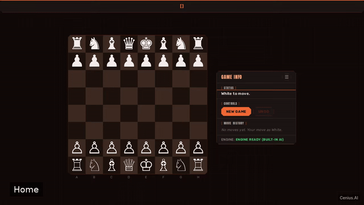
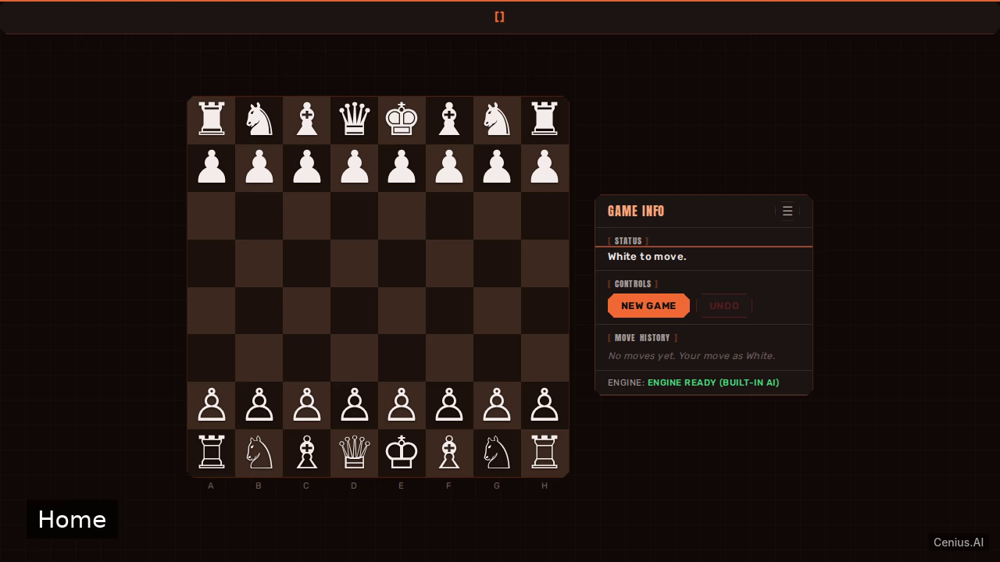
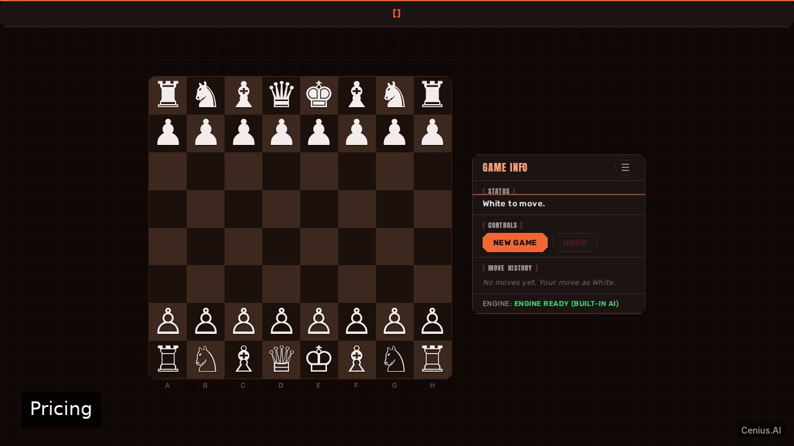

# Grandmaster Chess — Vite web application reference implementation

If you want a self-hosted web application without the vendor lock-in, **Grandmaster Chess** is ready to run. Built with Vite and Apache-2.0-licensed, Grandmaster Chess ships complete — one clone, one install command. A web-based chess game where players can challenge a grandmaster-level computer opponent. [Open Grandmaster Chess on cenius.ai](https://cenius.ai/marketplace/p/grandmaster-chess?ref=gh&utm_campaign=grandmaster-chess-vite) to customise it without touching a line of Grandmaster Chess code.


[](LICENSE)  [](https://cenius.ai)

[](https://cenius.ai/marketplace/p/grandmaster-chess?ref=gh&utm_campaign=grandmaster-chess-vite)

> **▶ [Open & edit in cenius.ai](https://cenius.ai/marketplace/p/grandmaster-chess?ref=gh&utm_campaign=grandmaster-chess-vite)** — one click to an editable workspace: describe changes in plain English, get an instant preview, one-click deploy and host. Modifications made on the platform come with full rebrand & relicense rights.

_Local clone? See [Quick start](#quick-start) below. cenius.ai is the zero-setup path._

## Demo



▶ **[See it in action](https://cenius.ai/marketplace/p/grandmaster-chess?ref=gh&utm_campaign=grandmaster-chess-vite)** — full demo on the project page · [MP4](.github/media/demo.mp4)

## Screenshots

  

## Features

- Interactive Chessboard
- Legal Move Validation
- Computer Opponent (Basic AI)
- Game State Detection
- Move History & Undo
- New Game
- Grandmaster AI Engine

## Quick start

```bash
./install.sh   # installs dependencies + seeds demo data
```

See [`INSTALL.md`](INSTALL.md) for full setup and usage instructions.

## Architecture

`./install.sh` gets you from a fresh clone to a running instance with sample data in a single step. The Vite codebase (24 files) is self-contained — no external services needed to evaluate it. Top-level layout: `public/`, `src/`. See [`INSTALL.md`](INSTALL.md) for complete setup instructions.

## Usage guide

After starting the development server (`npm run dev`), open your browser to `http://localhost:5173`.

### Interface
- **Chessboard**: The main playing area rendered by `board.js`. Drag and drop pieces to move.
- **Controls**: Buttons provided by `controls.js`:
  - **New Game**: Reset the board to the starting position.
  - **Undo**: Take back your last move and the computer's response.
  - **Flip Board**: Rotate the board to view from Black's side.
- **Move List**: A panel (`moveList.js`) displaying the game's move history.
- **Status Display**: A bar (`statusDisplay.js`) showing current turn, check, checkmate, or stalemate.

### Gameplay
- You always play as White; the computer plays as Black.
- Make your move by dragging a piece. The computer will respond automatically.
- The game ends when checkmate or stalemate occurs, as indicated by the status display.

### Computer Opponent
- The computer uses the Stockfish engine, running locally via WebAssembly.
- It is configured for grandmaster-level play by default. No additional configuration is needed.

_Full guide: [`USAGE.md`](USAGE.md)_

## FAQ

### How do I run Grandmaster Chess on my own server?

`git clone` + `./install.sh` gets you a running instance — the install script provisions dependencies and demo data. Full steps live in [`INSTALL.md`](INSTALL.md); nothing external is needed to try it.

### Which technology stack does Grandmaster Chess use?

Powered by Vite. This repo is the real thing — full source, seed data, and all — ready to clone and start up. Highlights include grandmaster AI Engine.

### What license does Grandmaster Chess use?

Confirmed free for commercial use — MIT terms let you incorporate, resell, or ship it in any product. [LICENSE](LICENSE).

### Can I remove the Grandmaster Chess name and use my own?

Yes. The MIT license lets you remove the original branding and ship under your own name. For a guided approach, [remix it on cenius.ai](https://cenius.ai/marketplace/p/grandmaster-chess?ref=gh&utm_campaign=grandmaster-chess-vite): you get a fresh build with full rebrand and relicense rights.

### Is Grandmaster Chess editable without a developer?

[cenius.ai](https://cenius.ai/marketplace/p/grandmaster-chess?ref=gh&utm_campaign=grandmaster-chess-vite) handles the implementation. Tell it what you want in everyday words, pick up the updated build. No coding needed.

## License & rebranding

Released under the [Apache License 2.0](LICENSE) (© 2026 Cenius AI) — free for personal and commercial use. The Cenius name/logo are trademarks (see NOTICE).

**Need a customized version?** [Remix this app on cenius.ai](https://cenius.ai/marketplace/p/grandmaster-chess?ref=gh&utm_campaign=grandmaster-chess-vite) — modifications made on the platform come with **full rebrand & relicense rights** over your derivative.

## Built with cenius.ai

This entire application — code, design, seeded demo data — was generated on **[cenius.ai](https://cenius.ai)** from a plain-English description.

- 🚀 [Build your own app on cenius.ai](https://cenius.ai)
- 🎛️ [Remix Grandmaster Chess on the marketplace](https://cenius.ai/marketplace/p/grandmaster-chess?ref=gh&utm_campaign=grandmaster-chess-vite) — open it in a workspace, prompt for changes, and ship your own version.

More open-source apps: [the Cenius-ai catalog](https://github.com/Cenius-ai) · [showcase index](https://github.com/Cenius-ai/showcase)
